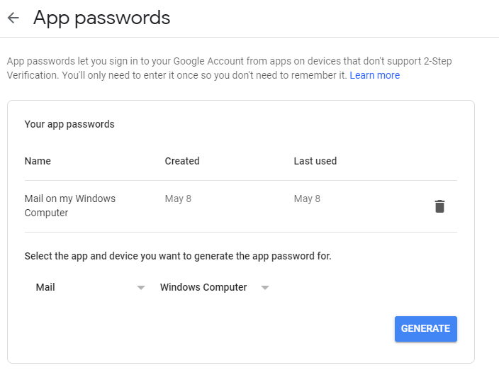

# GmailSender
.net console to send mail using gmail platform

Para utilizar o G-mail no app, deve ser liberado o acesso via app.

Acessar ao https://myaccount.google.com/security para criar um App Password que gera a senha a ser utilizado para o envio.

